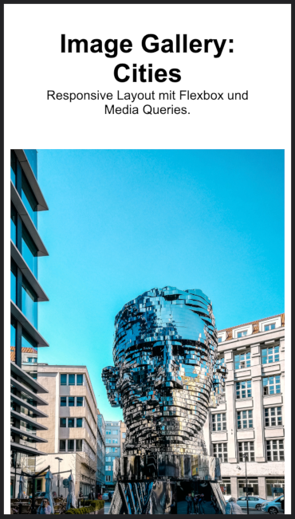

## Responsive Image Gallery mit Flexbox

Bearbeite die style.css Datei, um eine responsive Bilder Galerie zu erzeugen.
Beachte, dass die Galerie in allen Ansichten immer die volle Breite des Browsers nutzen soll (außer Margins)!

### Beispielansichten

#### Mobile View (< 600px, einspaltig)

#### Medium Size (600px - 800px, zweispaltig)

#### Large Size (>= 800px, vierspaltig)

